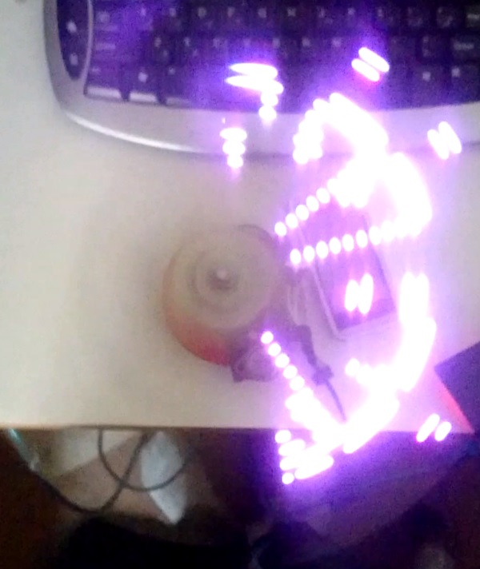
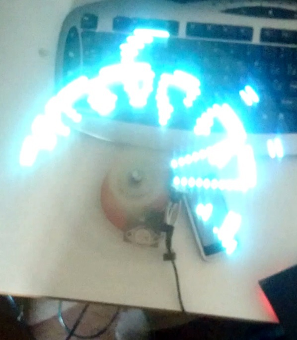

# RGB Rotating display
## Digital Circuits II Course Project
### Project Team Members:
- Masoud Babaabasi
- Milad Katiraei
- Kamal Barati
### About this project
In this project, we built an array of 16 RGB LEDs mounted on a motor structure. The Rotation of the array sweeps a circular area, which can be used as a display.
RGB LEDs are common anode and all of the color pins are connected together. The anode of LEDs are used as select pins. An Atmega64 is used as the central controller and RGB lines are connected to the timer hardware PWMs. An infra-red opto counter is mounted on the PCB for display synchronization with the rotation speed.

